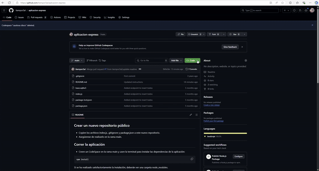
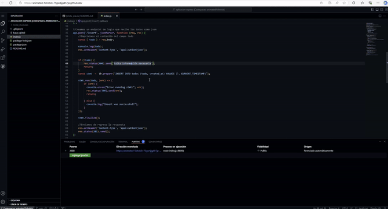

## Crear un nuevo repositorio público

* Copien los archivos index.js, .gitignore y package.json a este nuevo repositorio.
* Asegúrense de realizarlo en la rama main.

## Correr la aplicación 
* Creen un CodeSpace en la rama main y usen la terminal para instalar las dependencias de la aplicación:
```
npm install
```
Si se ha realizado satisfactoriamente la instalación, deberán ver una carpeta node_modules.

Posteriormente, para correr la aplicación:
```
node index.js
```

La aplicación creará el archivo de base de datos "base.sqlite3", y CodeSpace preguntará si desean hacer público el puerto 3000. Respondan que sí.

Pueden verificar que el puerto sea público en la pestaña "Puertos".

Copien la dirección pública que especifica CodeSpace en esta pestaña. Den clic en el enlace para aceptar que van a exponer la aplicación a Internet. 

El enlace debería poder usarse desde Postman o la aplicación móvil.

## Usar el archivo base.sqlite3 desde CodeSpace

Para interactuar con la base de datos SQLite desde CodeSpace, sigan estos pasos:

1. Abran una nueva terminal en CodeSpace.

2. Inicien una sesión de SQLite con el archivo de base de datos:
   ```
   sqlite3 base.sqlite3
   ```

3. Para ver el esquema de la tabla "todos":
   ```
   .schema todos
   ```

4. Para hacer consultas SELECT en la tabla "todos":
   ```
   SELECT * FROM todos;
   ```
   Esto mostrará todos los registros en la tabla.

5. Pueden hacer consultas más específicas, por ejemplo:
   ```
   SELECT * FROM todos WHERE created_at = <fecha>;
   ```
   Esto mostrará las tareas en una fecha en específico.

6. Para salir de la sesión de SQLite:
   ```
   .quit
   ```

Recuerden que SQLite es sensible a mayúsculas y minúsculas en los nombres de las tablas y columnas. Asegúrense de escribir los comandos exactamente como se muestran.

## Ejemplos

# Hacer fork del repositorio y mandar un cambio
[](assets/fork.webm)

# Iniciar la aplicación y habilitar el túnel (clic para descargar el video webm, despues elegir 'view raw')
### Nota: Usen un navegador para ver los videos
[](assets/iniciar.webm)

# Crear una rama y subir los cambios
[](assets/subir_cambio.webm)

# Usar Sqlite y Postman 
[](assets/insercion.webm)
